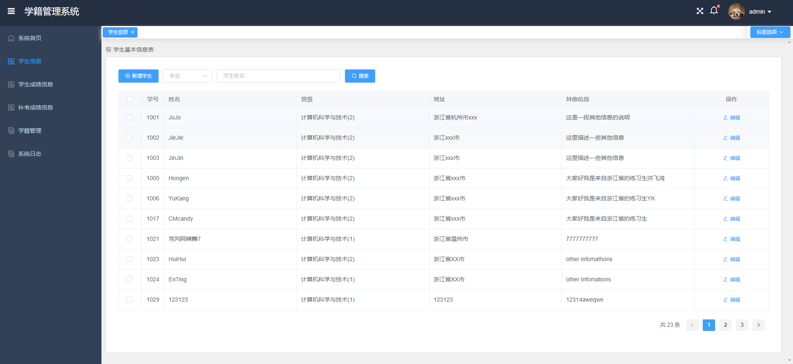
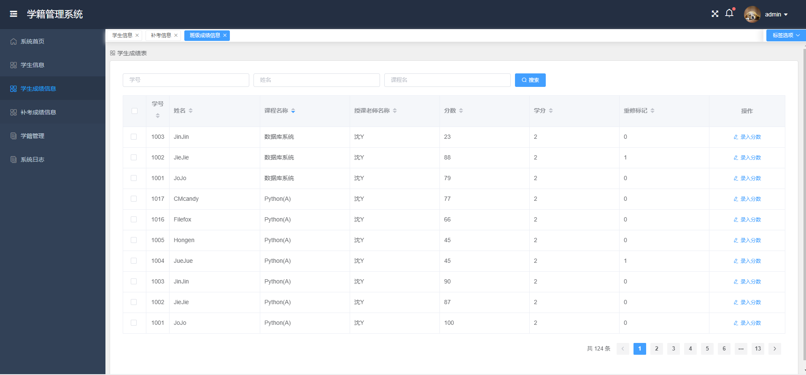
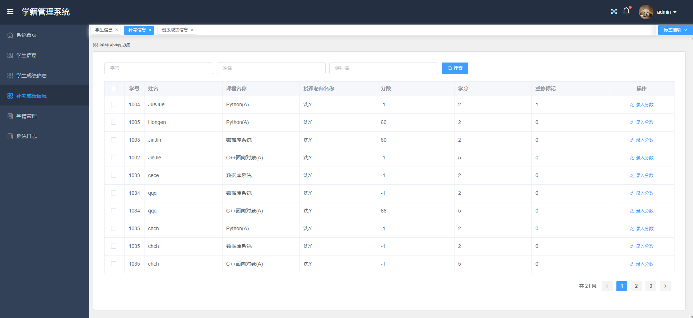
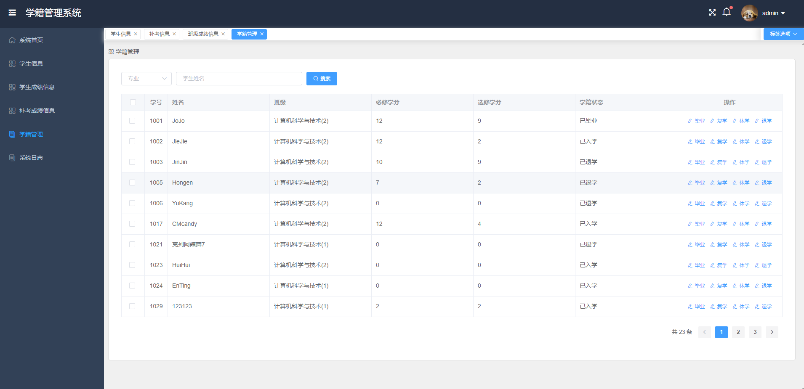
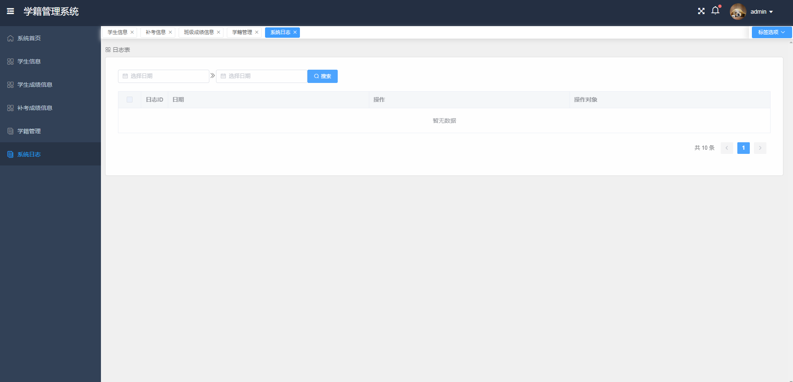
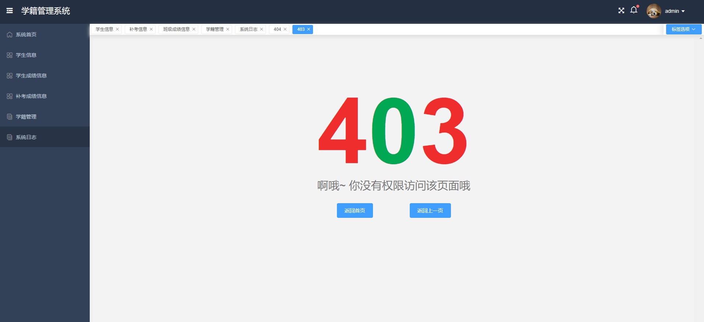

# student_status_management_vue

## 前言

- 学生学籍管理系统采用Springboot+vue开发，前后分离的设计使本项目有更好的可扩展性，该部分为学生管理系统前端，主要用到的技术栈有：Vue.js使用vue-cli4脚手架，axios，引用 Element UI 组件库，方便开发快速简洁好看的组件。

## 功能

-   [x] Element UI
-   [x] 登录/注销
-   [x] 学生信息管理界面
-   [x] 学生成绩信息管理界面
-   [x] 学生补考成绩信息管理界面
-   [x] 学生学籍信息管理界面
-   [x] 系统日志信息界面
-   [x] 权限测试
-   [x] 404 / 403

## 安装步骤

```
git clone git@github.com:ch98road/student_status_management_vue.git      // 把模板下载到本地
cd student_status_management_vue    // 进入模板目录
npm install         // 安装项目依赖，等待安装完成之后，安装失败可用 cnpm 或 yarn

// 开启服务器，浏览器访问 http://localhost:8080
npm run serve

// 执行构建命令，生成的dist文件夹放在服务器下即可访问
npm run build
```

##  项目截图

- 登陆界面

	

- 学生信息管理界面



- 学生成绩管理界面



- 学生补考成绩管理界面



- 学生学籍管理界面



- 系统日志管理界面



- 404界面


- 403界面

